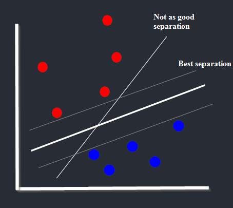

**This is a repository for data science concepts and other learning material which you've formulated in the "Questions and clarifications"-file as you've been working on a project. Remember to include synonyms when applicable.**

**Keep in mind that putting in the time making this file what it could be is justifiable in that it can be very pedagogical**

- https://programmathically.com/

Try to work at a slower pace, might be faster in the long run if you can avoid mistakes and overwhelming yourself.

The points closest to the margin support the plane. In multidimensional space, features which don't define the margin can often be left out, as in iterative feature removal.

<figcaption>The Amazon Rainforest contains a multitude of species.</figcaption>
